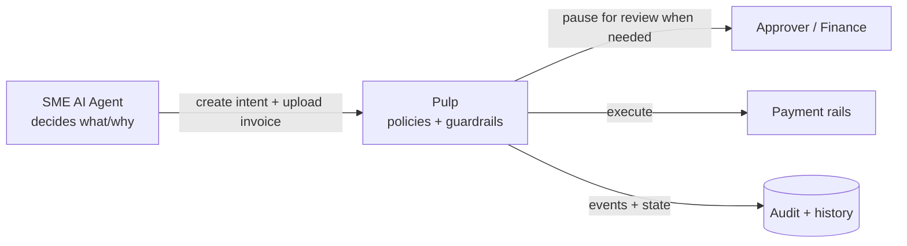
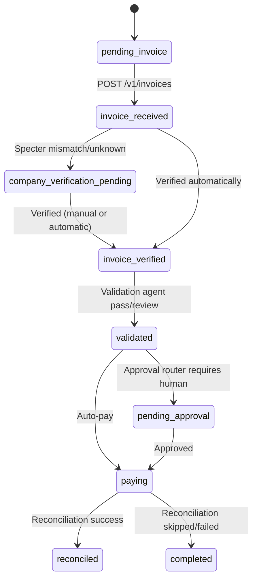

# Pulp — Autonomous Accounts Payable (Hack)

Pulp is a **full-stack autonomous accounts payable** prototype:

- A **React dashboard** for finance/ops teams to create payment intents and track invoice → approval → payment.
- A **FastAPI backend** that ingests invoices, parses them with an LLM, **verifies the vendor company details via Specter**, then runs a **LangGraph** workflow to validate, route approvals, pick a payment rail, execute payment, and reconcile.

This repo contains both the frontend (`frontend/`) and backend (`backend/`).

## What it’s meant to do

- **Create an intent**: “Pay vendor X up to Y for Z”.
- **Receive an invoice** (PDF upload) tied to that intent.
- **Extract invoice fields** using an LLM (vendor name/email, amount, currency, dates, line items, confidence).
- **Company verification step (Specter)**:
  - Uses Specter company search to sense-check the invoice vendor domain against the intent vendor email/domain.
  - If it does **not** match (or can’t be verified), the flow pauses at **`company_verification_pending`** so a human can review.
- **LangGraph pipeline** continues only after verification:
  - Validation agent checks invoice vs intent (amount tolerance, vendor trust, etc.)
  - Approval routing either auto-pays or pauses for human approval
  - Payment rail selection (Mock / Wise / Revolut / Yapily)
  - Payment execution and reconciliation

## Pulp for AI Agents (SMEs building their own agents)

Pulp is designed to be an **execution layer for agentic workflows** that need to safely move money.
Instead of letting an AI agent call a bank API directly, your agent can delegate financial operations to Pulp,
which enforces **guardrails + policies + auditability**.

- **Bring your own agent**: an SME can build domain-specific agents (e.g., procurement, facilities, logistics, retail ops)
  that decide *what* should be paid and *why*.
- **Pulp adds the financial operations layer**: Pulp handles the *how* safely:
  - **Policies**: thresholds, tolerance checks, known vendor rules, approval routing.
  - **Guardrails**: domain/company verification (Specter), validation agents, idempotency, rails allow-lists.
  - **Human-in-the-loop pauses**: `company_verification_pending`, `pending_approval`.
  - **Audit trail**: append-only `events` timeline + persisted intent/invoice/payment state.
  - **Pluggable execution**: choose rails (`mock`, `wise`, `revolut`, `yapily`) without changing agent logic.

Conceptually:



### Quickstart (AI agent tool calling via MCP)

Use Pulp as a **tool server** for your agent: your agent decides *what/why*, and Pulp enforces *how* safely (policies, guardrails, approvals, audit trail).

```ts
import { query } from "@anthropic-ai/claude-agent-sdk";
import Pulp from "@pulp/sdk";

const pulp = await Pulp.connect({ apiKey: "YOUR_API_KEY" });

for await (const msg of query({
  prompt: "Pay Acme Supplies £2,400 for the October invoice, ref INV-2024-089. Validate against our open intent and auto-pay if confidence is above 90%.",
  options: {
    mcpServers: {
      pulp: pulp.mcp(),
    },
  },
})) {
  console.log(msg);
}
```

### Quickstart (direct API client)

If you’re not using an agent framework, you can call Pulp directly via `@pulp/sdk`.

```ts
import Pulp from "@pulp/sdk";

const client = new Pulp({ apiKey: "YOUR_API_KEY" });

// Register a payment intent
const intent = await client.intents.create({
  vendor: { name: "Acme Supplies" },
  amount: { expected: 2400.0, currency: "GBP" },
  reference: "INV-2024-089",
});

console.log("Intent registered:", intent.id);
```

## Architecture (system diagram)

```mermaid
flowchart TB
  %% ---------- Clients ----------
  User[Finance / Ops user]
  FE[Frontend<br/>React + TS (Vite)]

  %% ---------- Backend ----------
  API[Backend API<br/>FastAPI]
  MW[Auth middleware<br/>API key]

  %% ---------- Persistence ----------
  DB[(Postgres<br/>SQLAlchemy models)]
  LG[(LangGraph checkpointer<br/>Postgres)]
  Blob[(Azure Blob Storage<br/>invoice PDFs)]

  %% ---------- External services ----------
  Claude[LLM<br/>Invoice parsing + agents]
  Specter[Specter API<br/>Company search]

  %% ---------- Pipeline / rails ----------
  Graph[LangGraph pipeline<br/>validate → approval → select rail → pay → reconcile]
  Rails[Payment rails<br/>mock / wise / revolut / yapily]

  %% ---------- Flows ----------
  User --> FE
  FE -->|/v1/*| API

  API --> MW
  MW --> API

  API -->|create intent| DB
  API -->|receive invoice| DB
  API -->|events + status updates| DB

  API -->|upload PDF (best-effort)| Blob
  API -->|parse invoice| Claude
  API -->|company verification search| Specter

  API -->|start pipeline| Graph
  Graph -->|checkpoint| LG
  Graph -->|read/write status + payment rows| DB
  Graph -->|validation + approval agents| Claude
  Graph --> Rails
  Rails -->|execute payment| Graph
  Graph -->|reconcile| DB
```

## Invoice processing timeline (state machine)



## Key backend concepts

- **Intent**: the unit of work (who/what/how much). Status is what the UI primarily tracks.
- **Invoice**: the uploaded document and parsed fields. Includes `company_verification` payload.
- **Events**: append-only timeline records (`invoice.received`, `invoice.company_verification_pending`, `payment.completed`, …).
- **LangGraph**: orchestrates the multi-step AP pipeline with persistence via Postgres checkpointer.

## Repository layout

```text
.
├── backend/   # FastAPI + LangGraph + SQLAlchemy + rails
└── frontend/  # React dashboard (Vite)
```

## Running locally

### Backend

```bash
cd backend
cp .env.example .env
# fill: DATABASE_URL, ANTHROPIC_API_KEY, JWT_SECRET, SPECTER_API_KEY

python3 -m venv .venv
source .venv/bin/activate
pip install -e .

uvicorn api.main:app --reload --port 8000
```

- **API**: `http://localhost:8000`
- **Docs**: `http://localhost:8000/docs`

If you’re adding the new invoice verification storage column:

```bash
python3 db/migrate_add_company_verification.py
```

### Frontend

```bash
cd frontend
npm install
npm run dev
```

Frontend runs at `http://localhost:5173` and (by default) talks to the backend at `http://localhost:8000`.

## Environment variables (high-signal)

- **Backend**
  - `DATABASE_URL`: Postgres connection string (async SQLAlchemy/asyncpg)
  - `ANTHROPIC_API_KEY`: LLM for parsing + agents
  - `SPECTER_API_KEY`: Specter company search for invoice vendor verification
  - `JWT_SECRET`: approval token signing secret
  - `RAILS_ENABLED`: `mock`, `wise`, `revolut`, `yapily` (comma-separated)
- **Frontend**
  - `VITE_API_URL`: override API base URL (defaults to local proxy)

## Current “pause” points for humans

- **Company verification**: `company_verification_pending` (domain mismatch/unknown)
- **Payment approval**: `pending_approval` (approval router requires human)